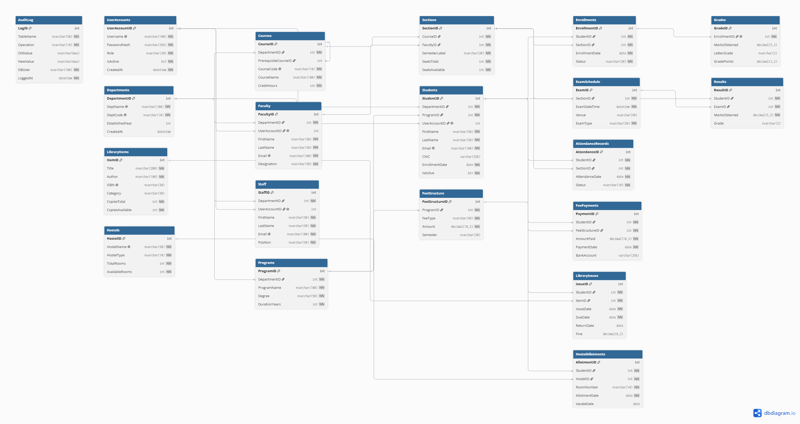

# HiSUP: HITEC Smart University Portal

> CS-402 Advanced Database Management Systems — Spring 2025  
> HITEC University Taxila, Department of Computer Science

---

## Live Site

🔗 **https://hisup-[RollNo].azurewebsites.net**  
*(Update this URL once deployed)*

---

## Team

| Name | Roll No | Contribution |
|------|---------|--------------|
| Arfa Mughal | 24-CS-088 | Database design and implementation, stored procedures/functions/triggers/views, backend business logic |
| Muskan Zahra | 24-CS-173 | Database integration, debugging, deployment, source control, cloud and Identity support |
| Javeria Khurshid | 24-CS-058 | Frontend UI and Razor view design, authentication workflow, student/faculty portal UX |

---

## Tech Stack

| Layer | Technology |
|-------|------------|
| Backend | ASP.NET Core 8 (C#) — MVC |
| Data Access | Entity Framework Core 8 + ADO.NET |
| Database | SQL Server 2019 via SSMS |
| Cloud DB | Azure SQL / Railway (MSSQL) |
| Frontend | Bootstrap 5 + Razor Views |
| Auth | ASP.NET Core Identity |
| Hosting | Azure App Service / Railway / Render |
| Source Control | Git + GitHub |

---

## Local Setup

### Prerequisites

- Visual Studio 2022 (Community or higher)
- SQL Server 2019 or later
- SQL Server Management Studio (SSMS)
- .NET 8 SDK
- Git

### Steps

1. **Clone the repository**
   ```bash
   git clone https://github.com/[username]/HITEC-ADMS-HiSUP-[RollNo].git
   cd HITEC-ADMS-HiSUP-[RollNo]
   ```

2. **Restore the database**  
   Open SSMS and run:
   ```
   database/HiSUP_DB_Script.sql
   ```
   This creates `HiSUP_DB` with all tables, procedures, functions, triggers, views, indexes, security objects, and seed data.

3. **Configure the connection string**  
   Edit `src/HiSUP/appsettings.Development.json`:
   ```json
   {
     "ConnectionStrings": {
       "HiSUP_DB": "Server=.;Database=HiSUP_DB;Trusted_Connection=True;TrustServerCertificate=True"
     }
   }
   ```

4. **Run EF Core migrations and start**
   ```bash
   cd src/HiSUP
   dotnet ef database update
   dotnet run
   ```

5. **Open in browser**  
   Navigate to `https://localhost:5001`

---

## Portal Modules

| Module | Description |
|--------|-------------|
| Auth | Login, registration, role-based redirect (Admin / Student / Faculty / Finance) |
| Student | Dashboard, course registration, fee payment, transcript download |
| Faculty | Attendance marking, grade entry, workload report |
| Admin | Student management, bulk import, audit log viewer, execution plan viewer |
| Library | Book search (full-text), issue and return with auto fine |
| Finance | Fee analytics dashboard, fee defaulters report |
| Reports | Semester attendance matrix, top students per department |

---

## ADMS Concepts Checklist

| # | Concept | Location |
|---|---------|----------|
| 1 | ER Diagram and relational schema | `docs/erd.png` |
| 2 | Normalisation to 3NF and BCNF | `docs/normalization_steps.pdf` |
| 3 | All constraint types | Every table in `HiSUP_DB` |
| 4 | Stored procedures (15+) | `database/procedures/` |
| 5 | User-defined functions (5+) | `database/functions/` |
| 6 | AFTER triggers (4+) | `database/triggers/` |
| 7 | INSTEAD OF trigger (1+) | `database/triggers/trg_PreventDuplicateEnrollment.sql` |
| 8 | Views including updatable (8+) | `database/views/` |
| 9 | Non-clustered indexes (4+) | `database/indexes/` |
| 10 | Filtered index and covering index | `database/indexes/` |
| 11 | Full-text search | Library search page + `database/indexes/` |
| 12 | Execution plan comparisons (3 pairs) | `docs/execution_plans/` |
| 13 | Explicit transactions with ACID | Fee, enrolment, and hostel procedures |
| 14 | SAVEPOINT and partial rollback | Bulk result upload feature |
| 15 | Isolation levels (2 documented) | `docs/project_report.pdf` |
| 16 | Deadlock simulation and C# retry | `database/` test script + AuditLog |
| 17 | Database roles with GRANT/DENY/REVOKE | `database/security/` |
| 18 | Row-Level Security policy | `database/security/rls_policy.sql` |
| 19 | Column encryption | `Students.CNIC`, `FeePayments.BankAccount` |
| 20 | Audit log via triggers | `AuditLog` table |
| 21 | Common Table Expressions | Prerequisite chain (recursive) + department reports |
| 22 | Window functions (5+ types) | `database/views/vw_StudentDashboard.sql` |
| 23 | Dynamic SQL with sp_executesql | Advanced search feature |
| 24 | PIVOT and UNPIVOT | Attendance matrix report |
| 25 | MERGE statement | Bulk grade import |
| 26 | Backup and restore scripts | `database/backup/` |
| 27 | Cloud database migration | Live site connected to cloud DB |
| 28 | ASP.NET Core with EF Core and ADO.NET | `src/HiSUP/` |
| 29 | EF Core migrations | `src/HiSUP/Migrations/` |
| 30 | Live public deployment | Live URL above |

---

## Repository Structure

```
HITEC-ADMS-HiSUP-[RollNo]/
├── README.md
├── .gitignore
├── .github/
│   └── workflows/
│       └── build-and-deploy.yml
├── docs/
│   ├── erd.png
│   ├── schema_diagram.png
│   ├── normalization_steps.pdf
│   ├── execution_plans/
│   ├── ai_usage_log.md
│   └── project_report.pdf
├── database/
│   ├── HiSUP_DB_Script.sql
│   ├── procedures/
│   ├── functions/
│   ├── triggers/
│   ├── views/
│   ├── indexes/
│   ├── security/
│   └── backup/
├── src/
│   └── HiSUP/
│       ├── Controllers/
│       ├── Models/
│       ├── Views/
│       ├── Data/
│       ├── Services/
│       ├── Migrations/
│       ├── appsettings.json
│       ├── appsettings.Development.json
│       └── appsettings.Production.json
└── data/
    ├── seed_students.csv
    └── seed_courses.csv
```

---

## ER Diagram



---

## AI Tools Used

See [`docs/ai_usage_log.md`](docs/ai_usage_log.md) for a full log of all AI tool usage, what was generated, what was modified, and what was learned.

---

## Deployment

The production connection string is never stored in this repository. It is set as an environment variable (Application Setting) on the hosting platform.

```json
// appsettings.Production.json — safe to commit, no secrets here
{
  "ConnectionStrings": {
    "HiSUP_DB": ""
  }
}
```

See `docs/project_report.pdf` for full deployment steps and screenshots.

---

## Security Notice

> Committing a real database password or connection string to this repository will result in a **10-mark deduction** per project brief. Always use environment variables for production secrets.

---

*CS-318 | Spring 2026 | HITEC University Taxila*
